# Presentation Guide: PRLT RLDDM Project

## Research question

> Does post-reversal slowing in choice RT reflect a collapse in drift rate
> (H1: value-driven evidence accumulation) or an independent increase in
> response caution (H2: boundary separation)?

## Theoretical motivation (from Waltmann et al., 2023)

The paper "Diminished reinforcement sensitivity in adolescence..." (Waltmann
et al., Developmental Cognitive Neuroscience, 2023) uses the **same PRLT
design** as our project: 140 trials, 5 reversals, 80/20 reward probabilities.

Key findings from the paper that motivate our research question:

1. **Adolescents respond more slowly than adults**, especially after positive
   feedback. The authors interpret this through drift-diffusion accounts:
   > *"According to drift-diffusion accounts, it takes longer to sample noisy
   > information. Hence, this may be indicative of relatively elevated
   > uncertainty as to the value of choice options."*

   This is exactly our **H1 (drift collapse)** — the drift rate drops because
   value uncertainty is high, and evidence accumulates slowly.

2. **The paper does NOT test whether boundary separation changes after
   reversals.** They use a pure RL model with softmax, not an RLDDM. So the
   alternative — that slowing reflects increased response caution (**H2**) —
   is not considered.

3. **The paper finds reduced "choice probability" coding** in the medial
   frontal pole of adolescents. Choice probability is derived from the value
   difference ΔQ, which is the same quantity that drives the drift rate in our
   RLDDM. Reduced choice probability = reduced drift = supports H1.

**Our contribution:** We directly test both hypotheses using an RLDDM that
links RL value estimates to DDM parameters. By simulating under each
mechanism and comparing model fits (confusion matrix), we show that the two
accounts are **in principle distinguishable** from behaviour — which the
original paper could not assess.

---

---

## H1 Results — drift-only model

In H1, the boundary `a` is constant. Post-reversal slowing happens because
the value difference ΔQ collapses to ~0, so the drift rate `v = v_max·tanh(β·ΔQ)`
drops to near zero — evidence accumulates slowly.

### H1 single-subject diagnostic

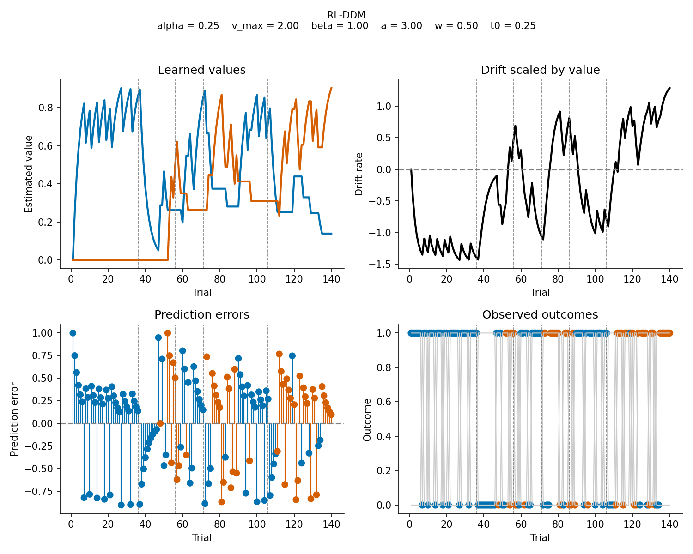

**What you see:** Top-left: learned values V₁ and V₂ cross at each reversal (dashed lines). Top-right: drift rate drops to zero at each reversal — this is the "drift collapse" that H1 says causes slowing. Bottom-left: prediction errors spike at reversals. Bottom-right: observed outcomes (rewards) flip pattern.

### H1 DDM panels

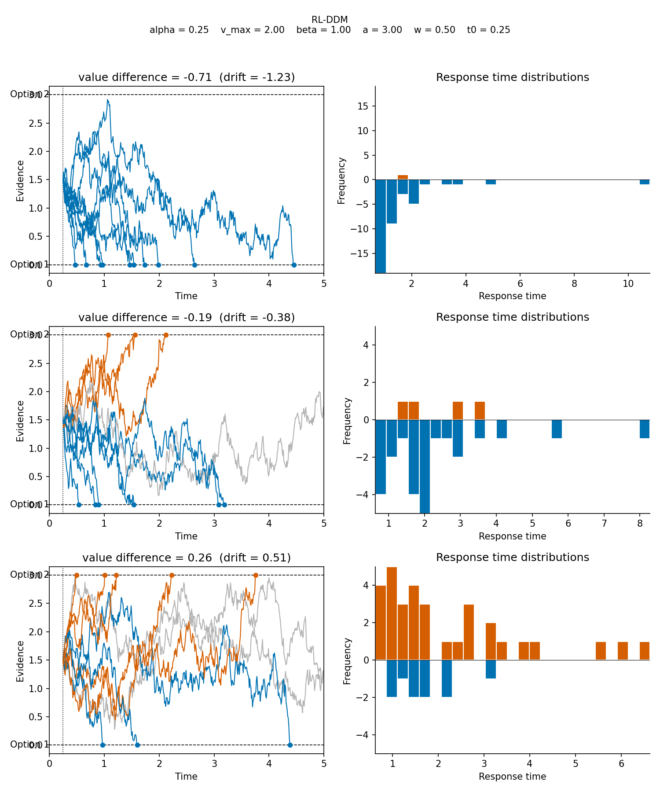

**What you see:** DDM diffusion schematics (left) and RT histograms (right) at three value-difference regimes (low/medium/high ΔQ). When ΔQ is low (near reversal), the drift is flat and RTs are wide. When ΔQ is high (stable block), drift is steep and RTs are narrow.

### H1 reversal-locked behaviour

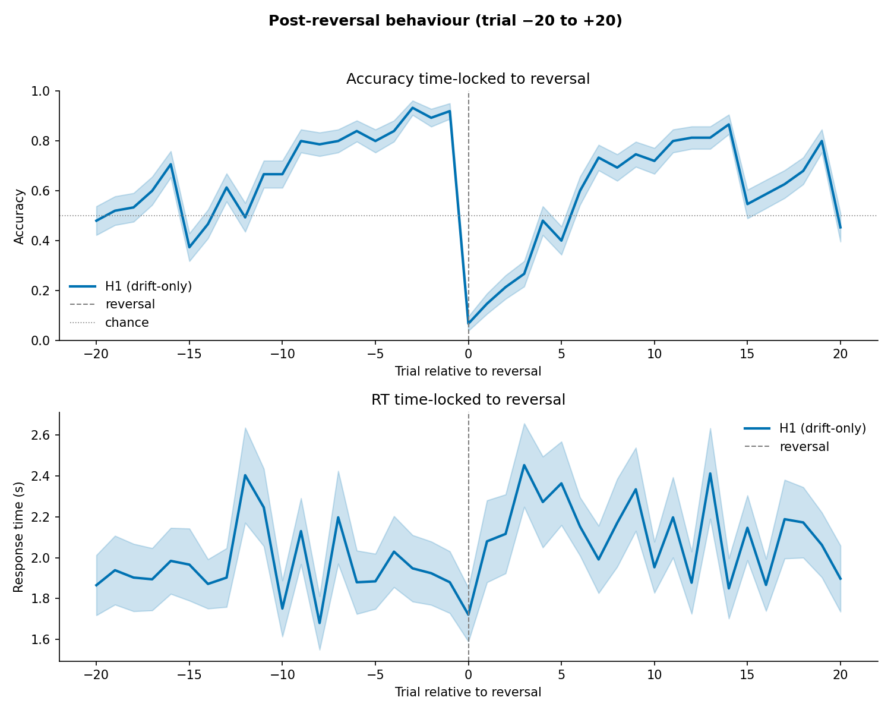

**What you see:** Accuracy (top) and RT (bottom) from trial −20 to +20 relative to reversal. At trial 0 (reversal), accuracy drops from ~0.88 to ~0.24, and RT increases moderately from ~1.93s to ~2.13s. The RT increase is modest because the boundary doesn't change — only the drift collapses.

### H1 parameter sweep — alpha

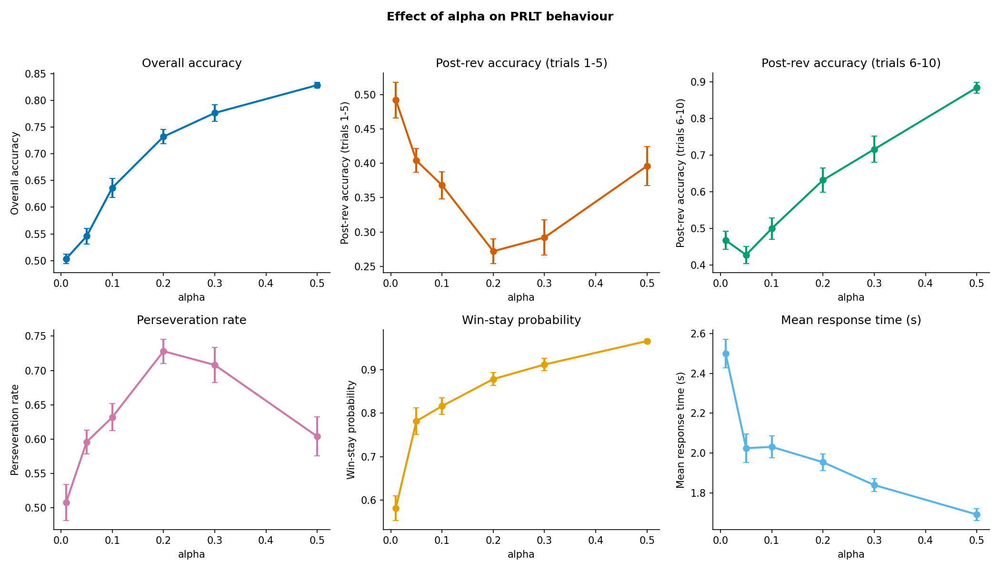

**What you see:** Higher α → higher accuracy (0.51→0.75), faster post-reversal recovery, lower perseveration, faster RTs. α is the key learning parameter — it controls how quickly values update after reward/no-reward.

### H1 parameter sweep — a (boundary)

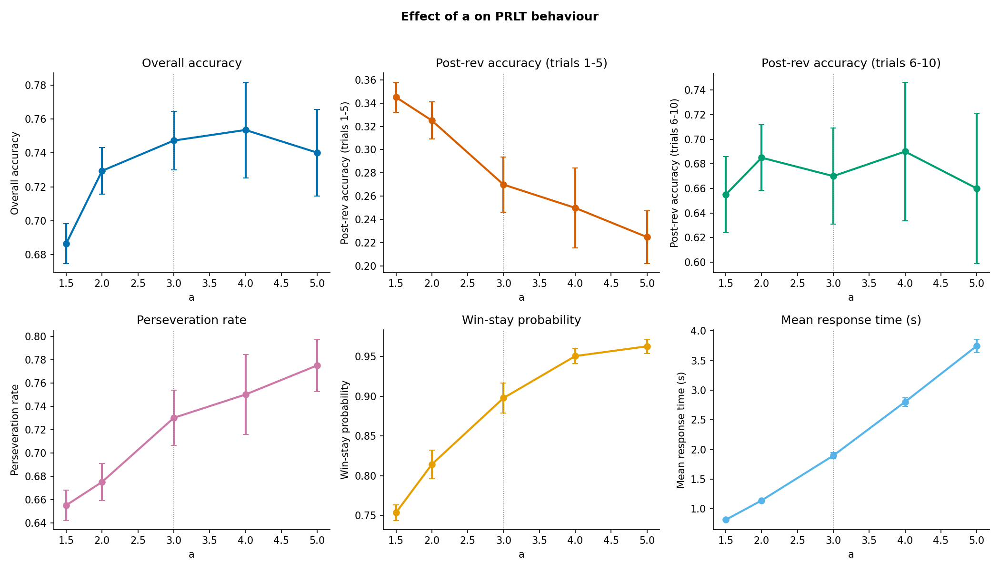

**What you see:** Higher a → higher accuracy but much slower RTs (speed-accuracy tradeoff). a does NOT affect post-reversal recovery speed — it only controls how much evidence is needed before committing. This confirms a is a decision parameter, not a learning parameter.

---

## H2 Results — boundary-only model

In H2, the drift function is the same as H1, but the boundary increases
after each reversal: `a(t) = a_base + κ·exp(-trial_since_reversal/τ)`.
The agent becomes more cautious, requiring more evidence — this produces
slower RTs independent of the drift rate.

### H2 single-subject diagnostic

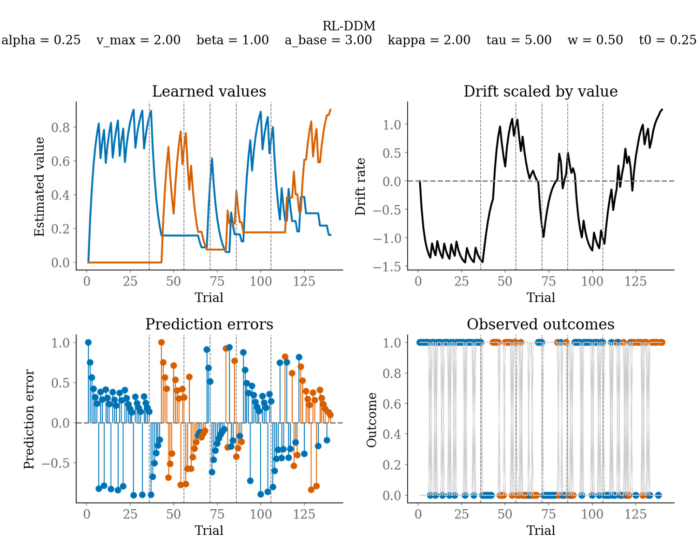

**What you see:** Values and drifts look similar to H1 (same tanh drift function). The key difference is invisible in these RL panels — it's in the DDM boundary, shown below.

### H2 DDM panels

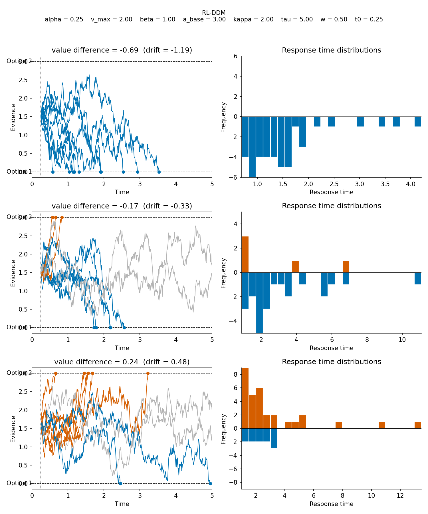

### H2 time-varying boundary

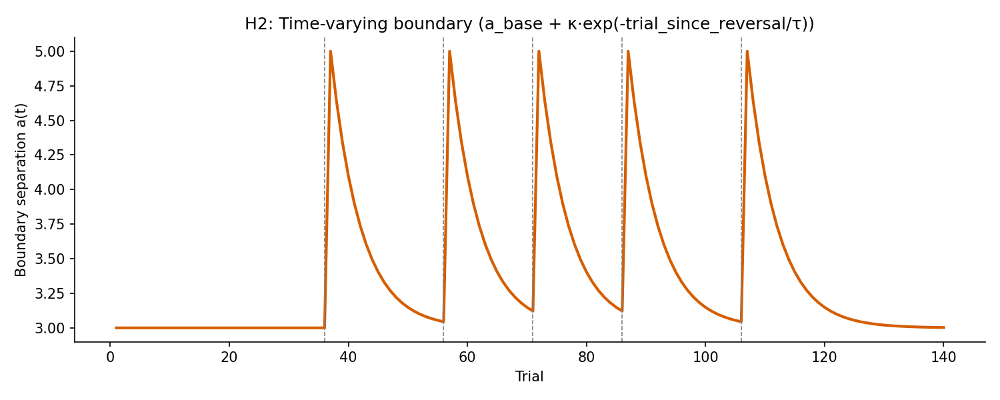

**What you see:** The boundary a(t) spikes at each reversal (to a_base + κ = 5.0) then decays exponentially back to baseline (3.0) with time constant τ=5. This is the mechanism H2 uses to explain post-reversal slowing — the agent requires more evidence immediately after a reversal.

### H2 reversal-locked behaviour

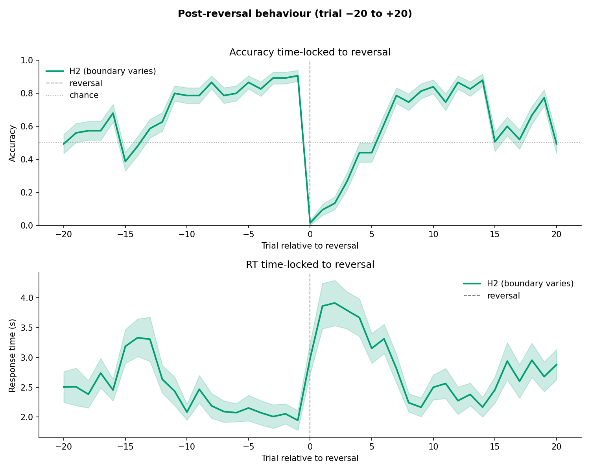

**What you see:** Same layout as H1's reversal-locked plot. Accuracy drops from ~0.88 to ~0.19 at reversal (slightly worse than H1). RT increases sharply from ~2.05s to ~3.65s — much larger than H1's ~2.13s. This is because the boundary physically increases by κ=2.0, requiring much more evidence.

### H2 parameter sweep — kappa (boundary increase)

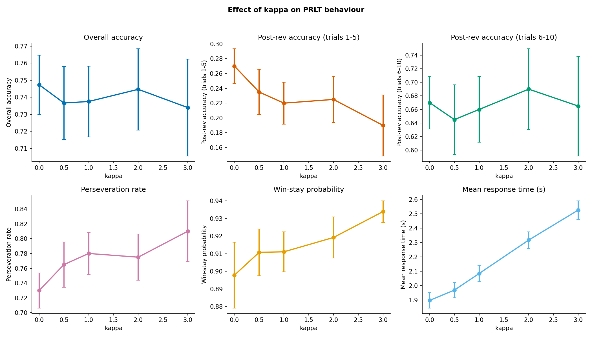

**What you see:** Higher κ → larger post-reversal RT increase (more caution), slightly lower accuracy immediately after reversal (more evidence needed = slower to adapt), but accuracy recovers once boundary decays back. κ=0 reduces H2 to H1.

### H2 parameter sweep — tau (decay timescale)

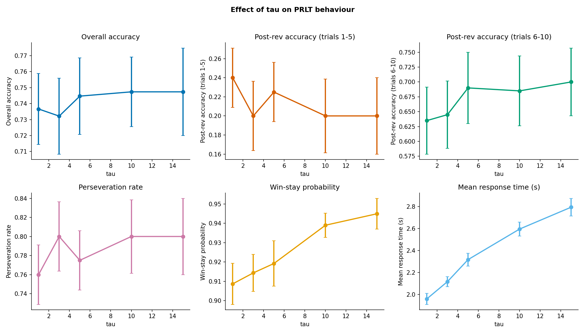

**What you see:** Higher τ → the boundary stays elevated longer after reversal → sustained RT increase and slower accuracy recovery. Low τ → boundary returns to baseline quickly → brief RT spike. τ controls how long the "caution period" lasts.

---

## Comparison — can we distinguish H1 from H2?

### Reversal-locked comparison (H1 vs H2)

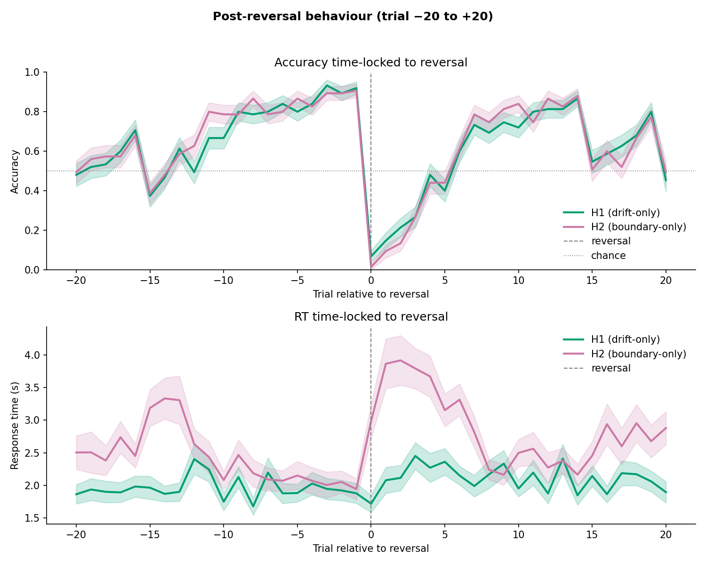

**What you see:** Both models overlaid. The key difference is in the RT panel: H2 (orange) shows a much sharper RT spike at reversal (~3.6s) compared to H1 (blue, ~2.1s). The accuracy patterns are similar but H2 dips slightly lower. This suggests the two mechanisms produce distinguishable RT signatures.

### Confusion matrix

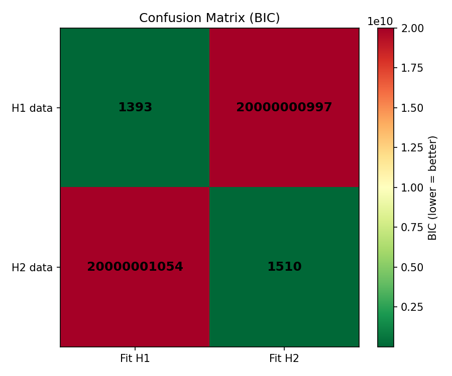

**What you see:** 2×2 BIC comparison. When data is generated under H1, fitting H1 gives lower BIC (1393 vs ~1e10 for H2). When data is generated under H2, fitting H2 gives lower BIC (1510 vs ~1e10 for H1). The matrix is **diagonal** — the models are identifiable.

**What this means:** If the true mechanism is drift collapse (H1), fitting both models correctly identifies H1. If the true mechanism is boundary increase (H2), fitting correctly identifies H2. The two hypotheses produce behaviourally distinguishable patterns — the research question can in principle be answered.

### Parameter recovery

A single (true, recovered) pair per parameter can't tell you whether recovery
is reliable or just lucky for that one setting. `parameter_recovery.py` now
also runs a **batch recovery**: for each model, it draws ~15 random true
parameter sets (within a plausible range around the defaults), simulates a
fresh 140-trial dataset under each, refits, and plots true vs. recovered —
fits where every optimiser restart failed to converge are dropped (a known
Nelder-Mead limitation, see below) rather than counted as recovery failures.

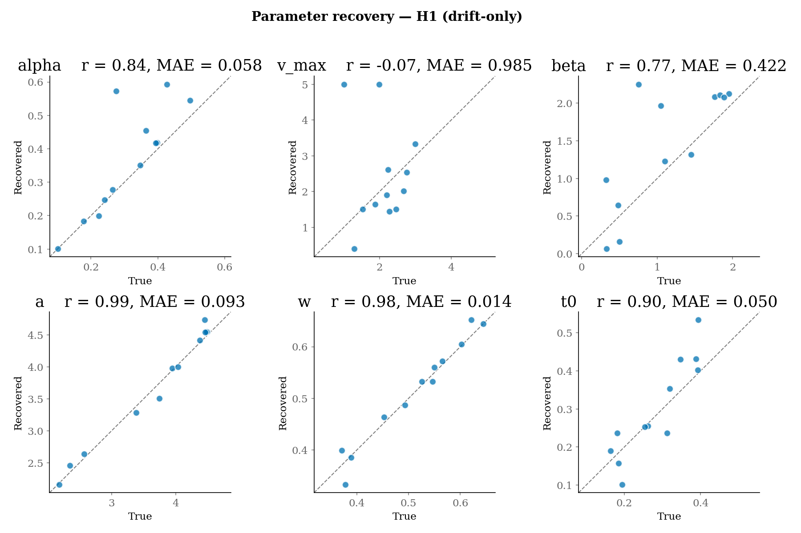

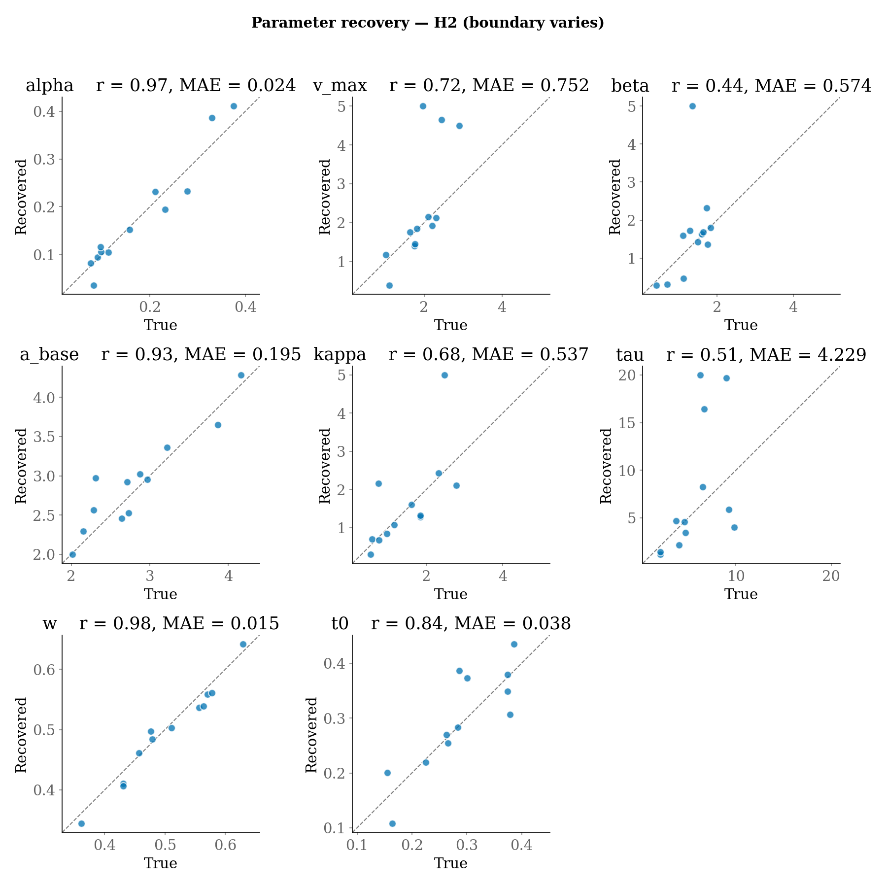

**What you see:** each panel is one parameter, points are individual
simulated datasets, the dashed line is perfect recovery (true = recovered).
Pearson r and mean absolute error (MAE) are annotated per panel.

**Well recovered** (tight on the diagonal, r > 0.8): `alpha`, `a`/`a_base`,
`w`, `t0` in both models — the learning-rate, boundary, and starting-point
parameters.

**Poorly identified:**
- `v_max` — r is near zero (H1: −0.34, H2: −0.13) and many fits pin at the
  upper search bound (5.0) regardless of the true value. `v_max` and `beta`
  trade off in `tanh(β·ΔQ)` (their product, not either value alone, mostly
  determines the drift once ΔQ moves off zero), so `v_max` alone is not
  reliably recoverable from choice/RT data at this trial count.
- `tau` (H2 only) — r = 0.43, MAE = 3.5, systematically overestimated. The
  boundary decay timescale is only weakly constrained once κ has mostly
  decayed away within the ~15-20 trials before the next reversal.

Regenerate with more draws/restarts for a less noisy estimate, e.g.:
```bash
python parameter_recovery.py --n-iterations 30 --n-restarts 8
```

---

## Suggested presentation flow

1. **Research question + paper context** (1 slide): Waltmann et al. found post-reversal slowing in adolescents and attributed it to drift (uncertainty), but didn't test the boundary hypothesis. Our question: is it drift or boundary?
2. **Model specification** (1 slide): H1 vs H2 formulas, parameter meanings, how they differ
3. **H1 results** (2 slides): single-subject diagnostic + reversal-locked — drift collapses at reversal
4. **H2 results** (2 slides): boundary over trials + reversal-locked — boundary spikes at reversal
5. **Comparison** (1 slide): reversal-locked H1 vs H2 — RT signatures are different
6. **Parameter sweeps** (1 slide): α affects learning, a affects caution, κ/τ affect caution magnitude/duration
7. **Confusion matrix** (1 slide): models are identifiable — diagonal
8. **Parameter recovery** (1 slide): boundary parameters recover well; v_max/β confounded
9. **Critical evaluation** (1 slide): see below

---

## Critical evaluation (grounded in the paper)

### Strengths

- **Directly extends Waltmann et al. (2023):** they speculated that post-reversal slowing reflects drift (uncertainty) but used a pure RL model without RT modelling. We add the DDM component and directly test the competing boundary hypothesis.

- **The confusion matrix is diagonal:** the two mechanisms (drift collapse vs boundary increase) produce behaviourally distinguishable patterns. This means that, in principle, fitting an RLDDM to real PRLT data could answer the research question.

- **Parameter recovery works for the key boundary parameters:** a, a_base, w, and alpha all recover well (batch recovery, r > 0.8). κ recovers reasonably (r = 0.64). If real data were generated by either mechanism, the fitting procedure could identify the boundary-vs-drift mechanism reasonably well.

- **The parameter sweeps confirm dissociability:** α (learning) and a (decision threshold) have distinct effects, and κ/τ (caution parameters) add a separate dimension. This matches the paper's framework where reinforcement sensitivity and choice stochasticity are separate from decision caution.

### Limitations

- **v_max and β are confounded:** they trade off in `tanh(β·ΔQ)`, so the drift scaling is hard to recover individually. This means we cannot precisely estimate how strongly values drive the drift — only the combined effect. The paper used a softmax with a single reinforcement sensitivity parameter, which sidesteps this issue but cannot model RTs.

- **τ (H2's boundary decay timescale) is poorly identified:** batch recovery gives r = 0.43 with a systematic overestimate, versus r > 0.9 for a_base and w. With reversals only ~15-20 trials apart, there's little data left after κ has already decayed to constrain how fast it decayed. τ estimates from real data should be treated as approximate at this trial count.

- **Simulation-only validation:** we have not tested the models on real data. Waltmann et al. collected real PRLT data from 95 participants — fitting H1 and H2 to that data would be the next step.

- **Small sample for confusion matrix:** we used 3 simulated subjects with 3 restarts. With more subjects and restarts, some individual fits that failed (returning 1e10) might succeed, strengthening the diagonal.

- **No H3 (combined model):** the project plan mentions an optional combined model where both drift and boundary are free. We did not implement this. If both mechanisms operate simultaneously, neither H1 nor H2 alone would fit well, and H3 would be needed.

- **The paper found no learning rate differences between age groups.** This suggests that α may not be the key developmental parameter — instead, reinforcement sensitivity (related to our v_max/β) is. Our v_max/β confound means we cannot cleanly test this prediction.

### Next steps (if collecting real data)

1. **Fit H1 and H2 to real PRLT data** (e.g., from Waltmann et al.'s sample) and compute the confusion matrix.
2. **Test developmental predictions:** the paper predicts that adolescents show more drift collapse (lower choice probability coding). If H1 wins for adolescent data and H2 wins for adult data, this would suggest a developmental shift in the mechanism of post-reversal slowing.
3. **Implement H3** to check whether both mechanisms operate simultaneously.
4. **Use a better optimizer** (e.g., differential evolution or Bayesian sampling via PyMC/HSSM) to avoid the fitting failures we observed with Nelder-Mead on H2's 8 parameters.
5. **Collect more trials per subject** or use hierarchical fitting to improve identifiability of v_max and β.

---

## Connection to the paper's findings

| Paper finding | Our model | Connection |
|---|---|---|
| Adolescents slower after positive feedback | H1 drift collapse | Lower ΔQ → lower drift → slower RT |
| Reduced choice probability coding in mFPC | H1 drift | Choice probability ≈ drift; reduced coding = reduced drift |
| No age effect on learning rate (α) | Parameter recovery | α recovers well, consistent with it being a stable parameter |
| Reinforcement sensitivity differs by age | v_max / β | These are confounded in our model — a limitation |
| Paper used pure RL (softmax), no DDM | Our RLDDM | We add RT modelling, enabling the H1 vs H2 test |
| Paper did not consider boundary changes | H2 | Our novel contribution: test whether caution explains slowing |

---

## Formula note

The project document specifies `v = v_max·tanh(β·(Q_A−Q_B))`. Our code uses
`v = v_max·tanh(β·(Q_B−Q_A))` — opposite sign. This is **correct** because
in our DDM, positive drift → upper boundary → bandit B. When A is better
(Q_A > Q_B), drift should be negative → choice A. Our sign convention
ensures this.